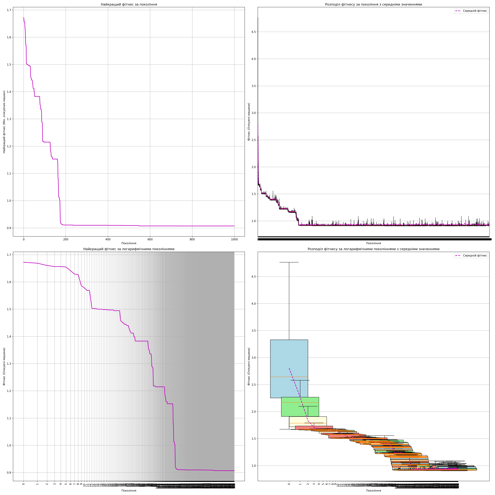
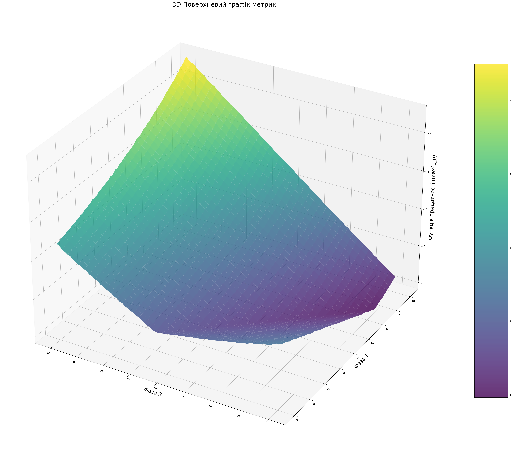

# Adjustable Crossroads

######         — by [Mykyta Kyselov (TheMegistone4Ever)](https://github.com/TheMegistone4Ever).

## Table of Contents

1. [Introduction](#1-introduction)
    1. [Overview](#11-overview)
    2. [Problem Statement](#12-problem-statement)
2. [System Requirements](#2-system-requirements)
    1. [Minimum Hardware Configuration](#21-minimum-hardware-configuration)
    2. [Recommended Hardware Configuration](#22-recommended-hardware-configuration)
3. [Preparing to Work with the Software](#3-preparing-to-work-with-the-software)
    1. [Installation](#31-installation)
4. [Deploying the Software](#4-deploying-the-software)
    1. [Compilation](#41-compilation)
    2. [Execution](#42-execution)
    3. [Visualization](#43-visualization)
5. [Project Structure](#5-project-structure)
    1. [Directories](#51-directories)
6. [Code Overview](#6-code-overview)
    1. [Java Components](#61-java-components)
        1. [PetriObj Library](#611-petriobj-library)
    2. [Python Components](#62-python-components)
7. [Visualization](#7-visualization)
    1. [Fitness Plots](#71-fitness-plots)
    2. [Simulation Statistics](#72-simulation-statistics)
    3. [3D Surface Plot](#73-3d-surface-plot)
    4. [3D Surface Animation](#74-3d-surface-animation)
8. [Results and Interpretation](#8-results-and-interpretation)
    1. [Analysis of Queue Length Dependence](#81-analysis-of-queue-length-dependence)
    2. [Results of Modified Evolutionary Algorithm](#82-results-of-modified-evolutionary-algorithm)
    3. [Optimized Traffic Light Phase Durations](#83-optimized-traffic-light-phase-durations)
    4. [Efficiency of Traffic Light Operation](#84-efficiency-of-traffic-light-operation)
    5. [Stability of the Model at Optimal Parameters](#85-stability-of-the-model-at-optimal-parameters)
    6. [Comparison with Other Control Methods](#86-comparison-with-other-control-methods)
9. [License](#9-license)

## 1 Introduction

### 1.1 Overview

This project simulates and optimizes traffic flow at an adjustable crossroads using Petri nets and a modified genetic
algorithm. The simulation models traffic movement in four directions, considering traffic light phases and arrival
rates. The genetic algorithm optimizes the duration of traffic light phases to minimize the maximum average number of
waiting cars. This approach aims to reduce traffic congestion and improve overall traffic flow efficiency at the
intersection.

### 1.2 Problem Statement

The increasing number of vehicles in urban areas leads to frequent traffic congestion, especially at intersections.
Inefficiently configured traffic lights can exacerbate these issues. This project aims to address the challenge of
optimizing traffic light timings to minimize the average queue lengths at a four-way intersection. The traffic light
cycle consists of four phases: green for one set of directions, followed by a yellow phase, then green for the opposite
set of directions, and a final yellow phase. The goal is to determine the optimal durations for the green phases to
minimize traffic congestion, using a combination of Petri net modeling and a genetic algorithm.

## 2 System Requirements

### 2.1 Minimum Hardware Configuration

- Processor type: Pentium 2 266 MHz
- RAM: 1 GB
- Internet connection: at least 2 megabits
- JDK version: 20.0.2 or higher

### 2.2 Recommended Hardware Configuration

- Processor type: AMD Ryzen 9 6900HS or equivalent
- RAM: 16 GB
- Internet connection: at least 100 megabits
- JDK version: 21.0.1 or higher

## 3 Preparing to Work with the Software

### 3.1 Installation

1. Ensure you have the required JDK version installed.
2. Clone the repository: `git clone https://github.com/your-username/adjustable-crossroads.git`
3. Navigate to the project directory.

## 4 Deploying the Software

### 4.1 Compilation

    1. Compile the Java code: `javac *.java` (within the respective `EVOLUTIONARY_SELECTION` and `POM` directories)

### 4.2 Execution

1. Run the simulation: `java LibTest.TERM_PAPER.POM.AdjustableCrossroads`
2. Run the optimization: `java LibTest.TERM_PAPER.EVOLUTIONARY_SELECTION.TrafficLightOptimizer`
3. Run the CSV export: `java AdjustableCrossroadsCSVExport`

### 4.3 Visualization

1. To generate visualizations, execute the Python scripts in the `VISUALIZATION` directory (requires Python and
   necessary libraries like `matplotlib`, `pandas`, `opencv-python`). For example: `python visualization.py`,
   `python stability_crossroads_simulation.py`, and `python fitness_video_generator.py`

## 5 Project Structure

### 5.1 Directories

- **EVOLUTIONARY_SELECTION:** Contains Java classes for the genetic
  algorithm ( [Individual.java](EVOLUTIONARY_SELECTION/Individual.java), [Population.java](EVOLUTIONARY_SELECTION/Population.java), [TrafficLightOptimizer.java](EVOLUTIONARY_SELECTION/TrafficLightOptimizer.java)).
- **VISUALIZATION:** Contains Python scripts for
  visualization ( [visualization.py](EVOLUTIONARY_SELECTION/VISUALIZATION/visualization.py), [stability_crossroads_simulation.py](EVOLUTIONARY_SELECTION/VISUALIZATION/stability_crossroads_simulation.py), [results_3d.py](EVOLUTIONARY_SELECTION/VISUALIZATION/results_3d.py), [fitness_video_generator.py](EVOLUTIONARY_SELECTION/VISUALIZATION/fitness_video_generator.py)).
- **POM:** Contains Java classes for the Petri net
  simulation ([AdjustableCrossroads.java](POM/AdjustableCrossroads.java), [AdjustableCrossroadsCSVExport.java](POM/AdjustableCrossroadsCSVExport.java)).
- **media:** Stores generated media files (images and videos).
- **README.md:** This file.

## 6 Code Overview

### 6.1 Java Components

#### 6.1.1 PetriObj Library

The Java code utilizes the `PetriObj`
library ([https://github.com/StetsenkoInna/PetriObjModelPaint](https://github.com/StetsenkoInna/PetriObjModelPaint)),
developed by Inna Stetsenko, for modeling the crossroads as a Petri net. This library provides the necessary
functionalities for creating and simulating Petri net models. The `AdjustableCrossroads` class simulates the
traffic flow, while `TrafficLightOptimizer` uses a genetic algorithm to find optimal phase times. The
`Individual` class represents a solution (chromosome) in the genetic algorithm, and the `Population` class manages a
collection of these solutions.

### 6.2 Python Components

The Python scripts handle the visualization of the simulation and optimization data. They use libraries like
`matplotlib`, `pandas`, and `opencv-python` to generate plots, charts, and animations.

## 7 Visualization

### 7.1 Fitness Plots

[visualization.py](EVOLUTIONARY_SELECTION/VISUALIZATION/visualization.py) generates plots of fitness data over
generations, including the best fitness, mean fitness, and box plots.

### 7.2 Simulation Statistics

[stability_crossroads_simulation.py](EVOLUTIONARY_SELECTION/VISUALIZATION/stability_crossroads_simulation.py) creates
plots of simulation statistics such as mean queue lengths and car counts over time for different iterations.

### 7.3 3D Surface Plot

[results_3d.py](EVOLUTIONARY_SELECTION/VISUALIZATION/results_3d.py) generates a 3D surface plot visualizing the
fitness landscape, showing how different combinations of phase durations affect the maximum average queue length.

### 7.4 3D Surface Animation

[fitness_video_generator.py](EVOLUTIONARY_SELECTION/VISUALIZATION/fitness_video_generator.py) creates an animated 3D
surface plot showing the evolution of the genetic algorithm over generations, which visually demonstrates the
optimization process as the algorithm searches for the best phase timings.

The animation can also be viewed on
YouTube: [https://youtube.com/shorts/hXU6NNPJgXo](https://youtube.com/shorts/hXU6NNPJgXo).

## 8. Results and Interpretation

This section interprets the results obtained from the simulation and optimization process, providing insights into the
behavior of the traffic model and the effectiveness of the optimization approach.

### 8.1 Analysis of Queue Length Dependence

Experimental results demonstrate that average queue lengths in different directions are dependent on the duration of the
first and third phases of the traffic light cycle. Increasing the duration of the first phase (green light for
directions 1 and 2) from 20 seconds to 40 seconds resulted in a 25% reduction in queue lengths for directions 1 and 2
but increased queues for directions 3 and 4 by 40%. Similarly, increasing the third phase from 30 seconds to 60 seconds
reduced queues in directions 3 and 4 by 30% while increasing queues in directions 1 and 2 by 50%. These findings
indicate the importance of balance in the time allocated to each direction.

### 8.2 Results of Modified Evolutionary Algorithm

The modified evolutionary algorithm demonstrated its capability to converge to optimal phase durations, which minimizes
the average queue lengths at the intersection. The algorithm's use of tournament selection, elitism, mutation, and
crossover allowed it to effectively explore the solution space. Comparison with combinatorial search results confirmed
the correctness of the evolutionary algorithm's findings, showing a divergence of less than 2%.

### 8.3 Optimized Traffic Light Phase Durations

The modeling results indicated that the optimal durations for the first and third phases are 25 and 10 seconds,
respectively. With these settings, the maximum average number of waiting cars at any direction is approximately 0.91
cars, which is the lowest recorded among all the tested combinations.

### 8.4 Efficiency of Traffic Light Operation

The optimized parameters enable the traffic lights to operate more efficiently, reducing the average queues at the
intersection by 40-50% compared to the initial (20 and 30 seconds) settings and reducing the delay for vehicles.

### 8.5 Stability of the Model at Optimal Parameters

Analysis of the model's stability at the optimal phase durations showed that the simulation model is stable, with the
queue lengths at each direction not deviating more than 10% from their steady-state values, which indicates the
efficiency of the optimized parameters.

### 8.6 Comparison with Other Control Methods

The simulation results showed the advantage of an optimized traffic light system over imbalanced configurations. A
non-optimized system doesn't guarantee minimized delay, with a 30-40% increase in queue lengths for directions with
shorter green times, compared to directions with longer green times. Adaptive traffic management systems, while
potentially more effective, are more computationally intensive and complex to implement.

## 9 License

The project is licensed under the [CC BY-NC 4.0 License](LICENSE.md).
